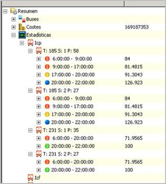

::: {#ventana-de-resumen-de-solución---estadísticas .section .level4}
#### Ventana de resumen de solución - Estadísticas

El último apartado de la ventana de resumen de la solución es
Estadísticas. El valor ICP (índice de capacidad de pasajeros), podemos
ver por trayecto cómo se cumple la demanda deseada de pasajeros por hora
establecida en la columna Capacidad, en el panel de Frecuencias.

[]{#_Toc465674603 .anchor}176 Resumen de solución -- estadísticas de
cumplimiento de la demanda de pasajeros

El círculo asociado a cada franja horaria indica el nivel de
cumplimiento de la capacidad de plazas respecto de la demanda óptima
programada. Los colores mostrados actúan como un semáforo, y representan
el porcentaje de cumplimiento sobre el óptimo:

-   Verde = la demanda se cumple en torno al 100%

-   Amarillo = la demanda se cumple entre el 90% y el 95%

-   Rojo = la oferta se queda por debajo del 90% de la demanda

-   Azul = la oferta sobrepasa la demanda al 110%

El porcentaje de cumplimiento se indica también con un valor
numérico.[[]{#_Toc289165961 .anchor}]{#_Ref335050196 .anchor}
:::
