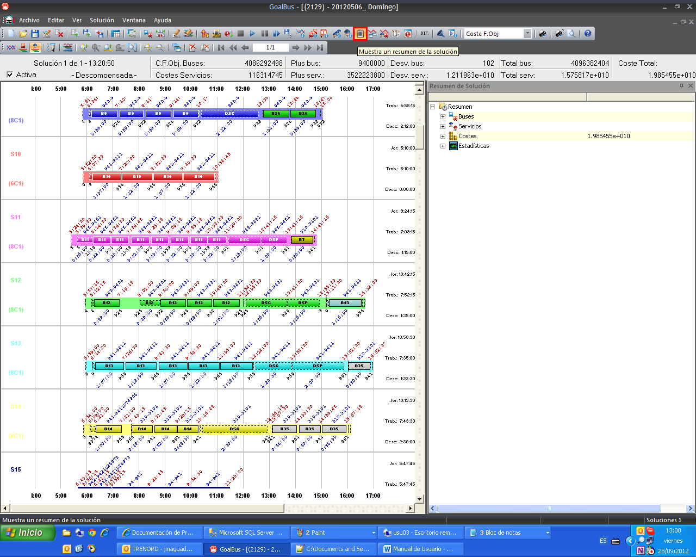

::: {#ventana-de-resumen-de-solución .section .level3}
### Ventana de resumen de solución

Otra ventana de gran uso y utilidad es la ventana resumen de la solución
que contiene toda la información del escenario, de manera más general,
recogida en una única ventana.

En apartados anteriores se han descrito las ventanas específicas de
información para servicios o autobuses donde se muestra la información
referente a los mismos con detalle. La ventana resumen de la solución
recoge la información más importante de esas otras ventanas en ella,
facilitando la consulta de dichos datos.

[]{#_Toc465674599 .anchor}172 Ventana de resumen de solución

La información que aparece en esta ventana se agrupa en cuatro
categorías:

-   Buses: información relacionada con los tipos de buses, depósitos y
    > kilometraje en la solución.

-   Servicios: información relacionada con los tipos de turno de los
    > servicios.

-   Costes: información relacionada con los costes de autobuses y
    > servicios en la solución.

-   Estadísticas: información relacionada con conceptos propios del
    > modelo.
:::
