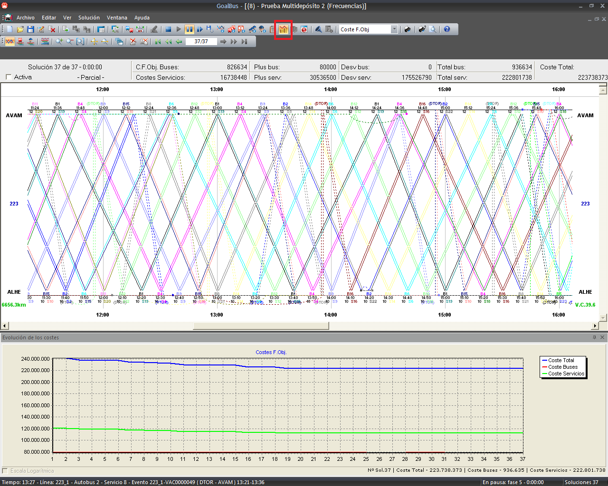
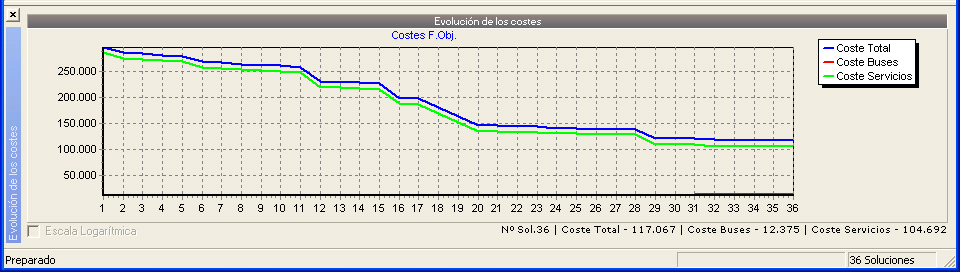

::: {#gráfica-de-evolución-de-los-costes .section .level3}
### Gráfica de evolución de los costes

Durante la generación de soluciones podemos visualizar cómo evolucionan
los costes a lo largo del proceso. Esta gráfica se convierte en una
herramienta fundamental para el análisis y valoraciones del impacto que
suponen cambios introducidos en cualquier escenario, tanto en
restricciones como en costes.

Al principio del cálculo cada solución varía mucho respecto de la
siguiente. En efecto, la herramienta encuentra soluciones pero puede
llevar algún tiempo antes de que se estabilicen; esta situación se
produce cuando la última solución encontrada no tiene grandes
diferencias de la precedente y la reducción del coste no es muy
importante.

Este punto de estabilidad también se reconoce por el hecho que la
velocidad con la cual la herramienta propone nuevas soluciones disminuye
notablemente. El tiempo que pasa calculando al encontrar la última
solución, sirve para demostrar que ningún cambio puede mejorar más los
costes.

[]{#_Toc465674604 .anchor}177 Gráfica de evolución de los costes
:::
