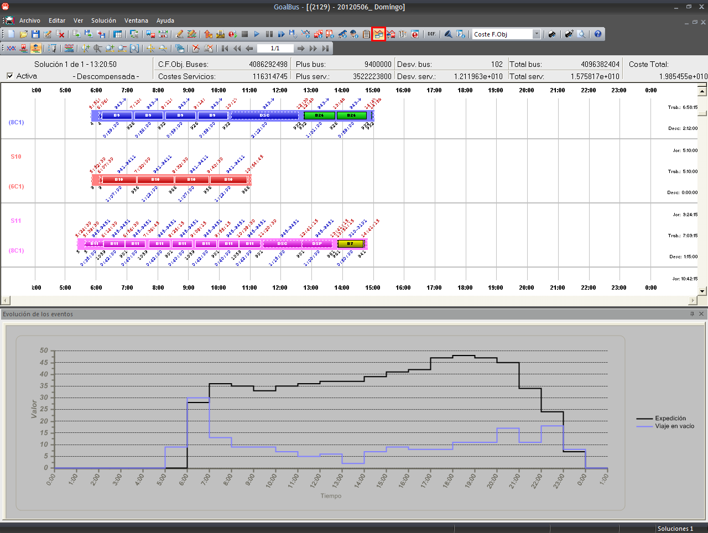

::: {#gráfica-de-evolución-de-los-eventos .section .level3}
### Gráfica de evolución de los eventos

Con el objetivo de mostrar la mayor información posible de una solución
calculada en GoalBus, cabe la posibilidad de ver la evolución de los
eventos de la misma. Existe una gráfica que recoge de manera fácil y
visual la evolución de los eventos que se deseen mostrar. La información
que contiene la gráfica es totalmente configurable por el usuario para
disponer, de esta manera, de la información que éste considere más útil.

En el ejemplo que se muestra a continuación se muestra la evolución de
los viajes en vacío y de las expediciones de la solución:

[]{#_Toc465674605 .anchor}178 Evolución del número de eventos durante el
día
:::
