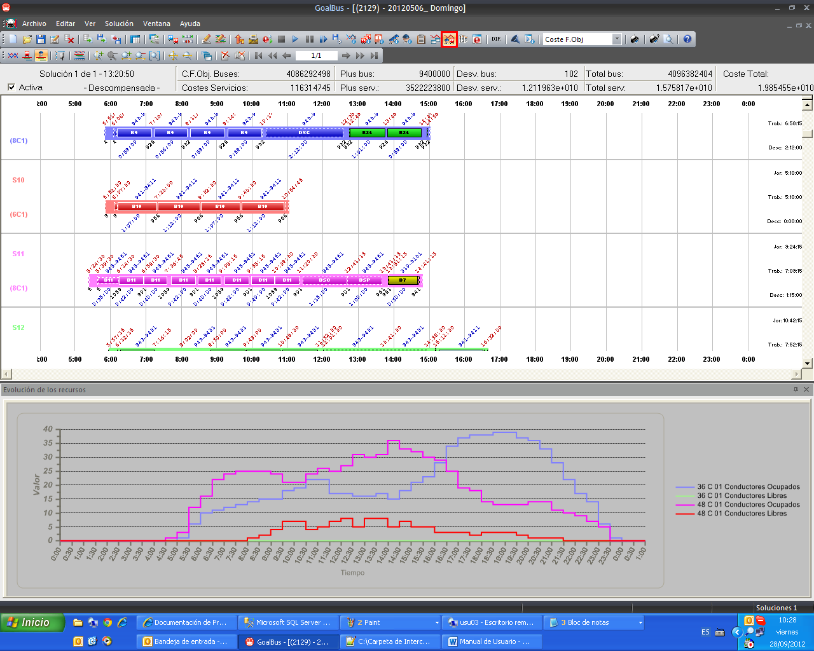

::: {#gráfica-de-evolución-de-los-recursos .section .level3}
### Gráfica de evolución de los recursos

Al igual que la gráfica de evolución de eventos vista en el apartado
anterior, existe una gráfica de evolución de recursos que muestra la
evolución de los tipos de recursos que se hayan seleccionado para su
representación.

Esta gráfica tiene las mismas características y mismas opciones que las
indicadas en el apartado anterior para la gráfica de evolución de
eventos.

[]{#_Toc465674606 .anchor}179 Evolución del número de recursos durante
el día
:::
