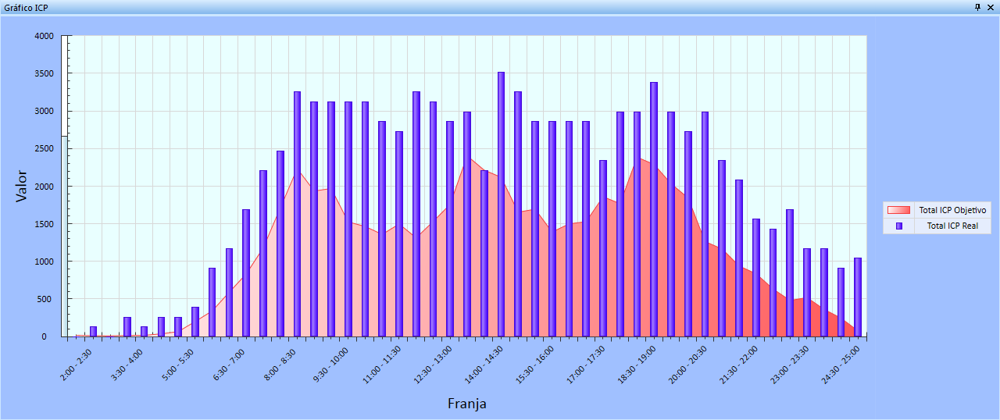
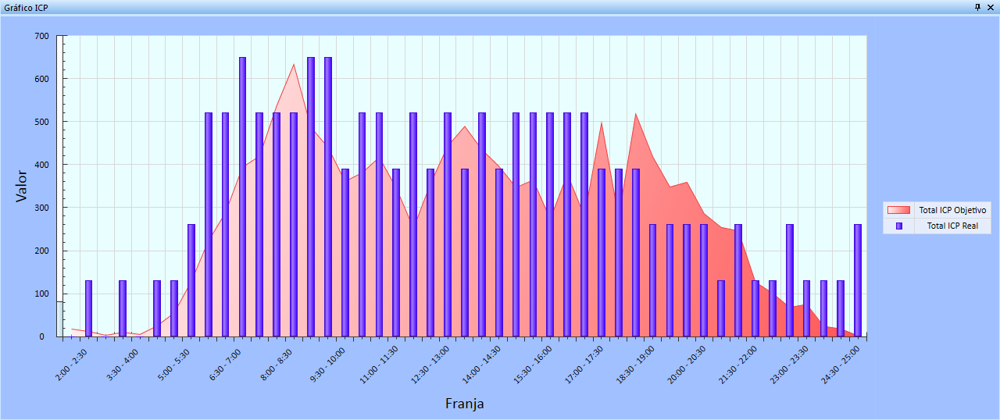

::: {#ejemplo-1 .section .level4}
#### Ejemplo

La siguiente imagen muestra un ejemplo de gráfico ICP para una solución.

[]{#_Toc465674610 .anchor}183 Gráfica ICP para total de trayectos

En el caso anterior, la gráfica responde al total de expediciones, y los
resultados se muestran por franja horaria. En color rojo podemos
apreciar el Total ICP Objetivo, es decir, la demanda de pasajeros
estimada en ese horario. Las barras de color azul representan el Total
ICP Real, es decir, el número de plazas ofertadas en la solución
ofertada. En este ejemplo se puede apreciar que se está realizando una
sobreoferta, ya que las plazas disponibles en los viajes de la solución
supera la demanda de pasajeros objetivo.

Es posible mostrar los resultados de un trayecto y un sentido
específicos. De este modo tendríamos la siguiente representación
gráfica:

[]{#_Toc465674611 .anchor}184 Gráfico ICP para trayecto y sentido
determinados

En este ejemplo, las plazas ofertadas son próximas a la demanda en la
mayoría de franjas del día. Sin embargo, a partir de las 19:00 se
aprecia claramente que no coinciden la oferta y la demanda.
:::
