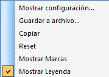
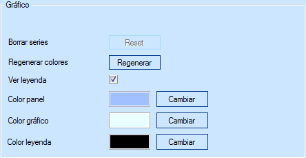
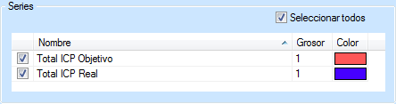
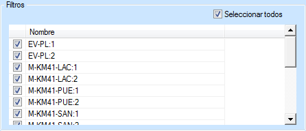

::: {#opciones-de-visualización-de-la-gráfica .section .level4}
#### Opciones de visualización de la gráfica

Haciendo clic con el botón secundario sobre la gráfica podemos acceder a
las siguientes opciones de visualización:

[]{#_Toc465674612 .anchor}185 Opciones de visualización de la gráfica

-   Al seleccionar la opción Mostrar configuración... se abre una
    > ventana de diálogo dividida en tres grupos.

    -   Gráfico. Permite modificar la apariencia general de la gráfica,
        > dando la opción de alterar el color del panel, de la gráfica y
        > de la leyenda.

[]{#_Toc465674613 .anchor}186 Opciones de visualización de la gráfica

-   Series. Podemos elegir las series que se visualizarán, así como su
    > grosor y el color de su representación.

[]{#_Toc465674614 .anchor}187 Visualización de las series

-   Filtros. Es en esta parte donde podemos elegir que trayectos y
    > sentidos queremos visualizar. Marcando la opción Seleccionar
    > todos, la gráfica reflejará el ICP para la totalidad de los
    > trayectos en ambos sentidos.

[]{#_Toc465674615 .anchor}188 Filtros de la gráfica

-   Guardar a archivo. Ofrece la posibilidad de guardar la gráfica como
    un archivo BMP (\*.bmp).

-   Copiar. Copia la gráfica al portapapeles y da la opción de pegarla
    en otro documento.

-   Reset. Devuelve la visualización de la gráfica a sus dimensiones
    originales en caso de que estas se hayan alterado. Para ampliar la
    gráfica basta con hacer clic sobre alguno de los elementos
    contenidos en ella.

-   Mostrar Marcas. Activando esta opción, se resaltan los puntos
    característicos de la gráfica.

-   Mostrar Leyenda. Activando esta opción, se muestra una leyenda de
    las series que aparecen en la gráfica.
:::
