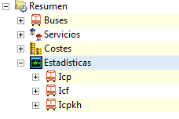

::: {#gráfica-de-evolución-de-capacidad-de-pasajeros .section .level3}
### Gráfica de evolución de capacidad de pasajeros

Al disponer de una solución válida y calculada, podemos visualizar una
gráfica que indica la oferta de plazas hora por hora en la solución.
Esta gráfica permite detectar rápidamente los horarios del día donde es
necesario modificar la frecuencia de viajes en la oferta, porque la
oferta de plazas no coincide con la demanda estimada de pasajeros.

La gráfica se accede pulsando en la barra de herramientas principal el
botón ICP (índice de carga de pasajeros).

[]{#_Toc465674607 .anchor}180 Gráfica ICP

La descripción analítica de la solución del Índice de Cumplimiento de
Plazas ofertadas se muestra en el resumen de la solución. A
continuación, desplegando la opción Estadísticas, podemos ver los
diferentes ICP organizados por trayecto y sentido.

[]{#_Toc465674608 .anchor}181 Muestra un resumen de la solución

[]{#_Toc465674609 .anchor}182 ICP
:::
