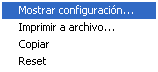
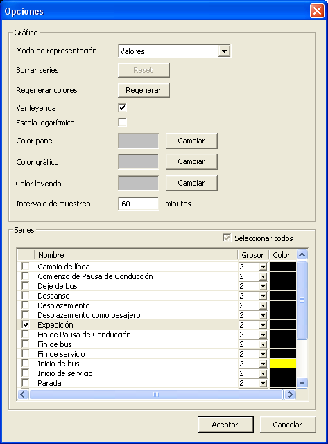
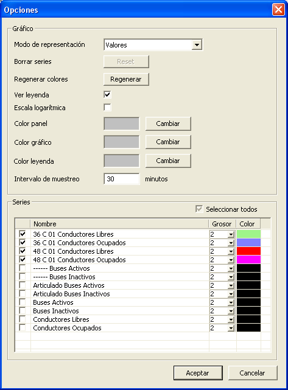
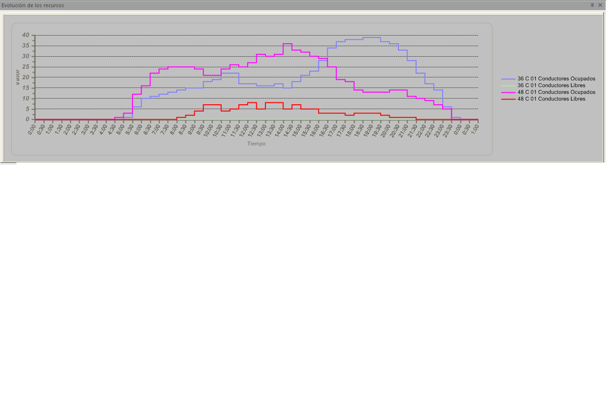
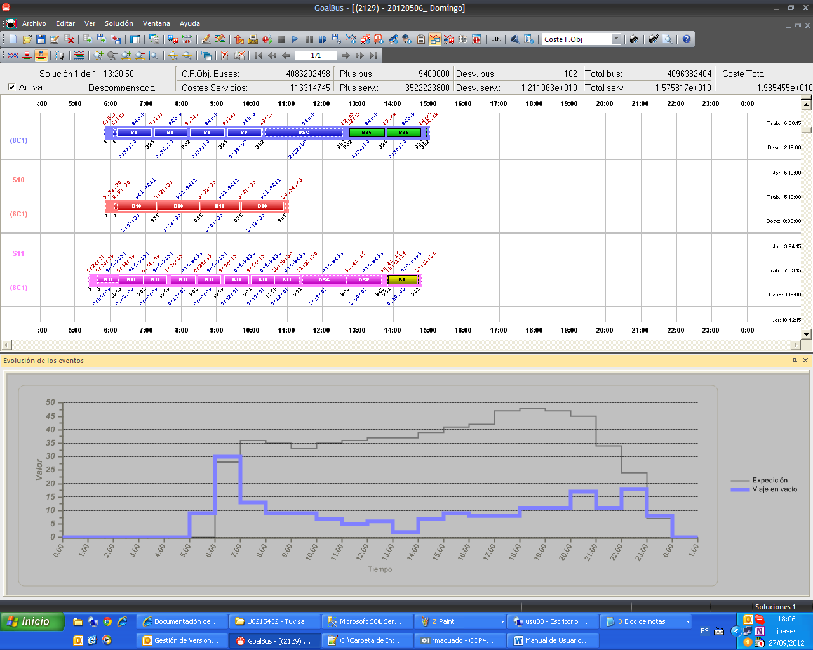

::: {#configuración-de-las-gráficas-de-evolución-de-los-eventos-y-recursos .section .level3}
### Configuración de las gráficas de evolución de los eventos y recursos

Pinchando con el botón derecho sobre las gráficas aparecerá una ventana
donde se permite cambiar y elegir la configuración de la gráfica de
evolución de eventos, imprimir dicha gráfica a un archivo, copiar o
resetearla.

En la ventana para configurar la gráfica se pueden elegir los eventos a
mostrar en la gráfica, los colores para los eventos, para el panel,
gráfico o leyenda.

[]{#_Toc465674616 .anchor}189 Ventana opciones

Así mismo se puede definir el intervalo (Intervalo de muestreo) en el
que se mostrarán los eventos. Para el siguiente ejemplo se ha definido
un intervalo de 30 minutos y se han cambiado los colores de los recursos
a mostrar en la gráfica:

[]{#_Toc465674617 .anchor}190 Intervalo de muestreo

[]{#_Toc465674618 .anchor}191 Ventana de evaluación de los recursos

En ambas gráficas al seleccionar la leyenda de un evento, la evolución
de éste se resaltará en el gráfico:

[]{#_Toc465674619 .anchor}192 Ventana grafica de un evento
:::
