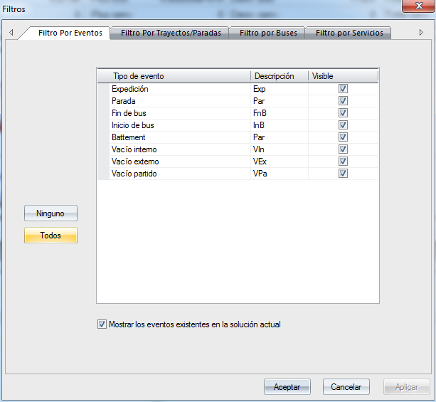

::: {#filtro-por-eventos .section .level3}
### Filtro por eventos

En este filtro, el usuario puede seleccionar los tipos de evento que
quiere visualizar en la solución. Para más información sobre los tipos
de evento, véase apartado 5.1 Tipos de evento.

Este filtro dispone de dos botones que permiten seleccionar todos los
eventos, Todos o deseleccionarlos todos, Ninguno.

[]{#_Toc465674620 .anchor}193 Filtro por eventos
:::
