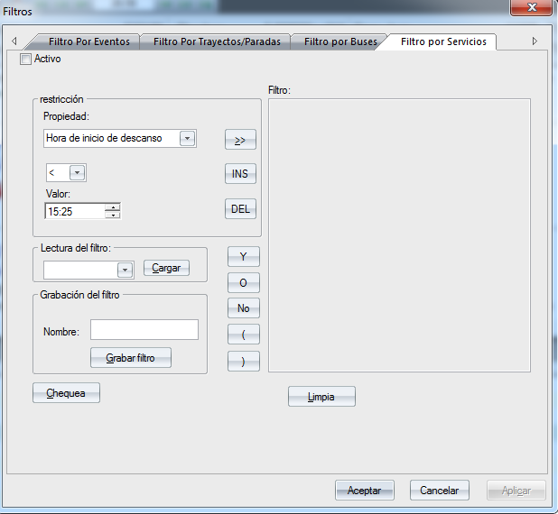
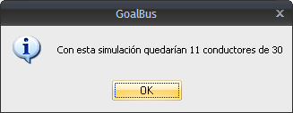
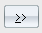

::: {#filtro-por-servicios .section .level3}
### Filtro por servicios

Con el filtro por servicios, se puede decidir de que en la solución de
GoalBus® se muestren, por ejemplo, sólo los servicios de conductor cuya
hora de inicio sea menor a las 09:00 AM, finalicen en una determinada
línea, mostrar sólo la duración de las paradas de los servicios de
conductor superiores a 10 minutos,...

[]{#_Toc465674621 .anchor}194 Filtro por servicios

Los elementos de este filtro que se visualizan en la ilustración son los
siguientes:

-   Activo: Dicha casilla debe estar activada para que GoalBus® aplique
    > en las ventanas de información el filtro correspondiente.

-   Restricción-\>Propiedad: En este despegable aparecen todas las
    > restricciones aplicables a un servicio de conductor.

-   Restricción-\>Operadores: Aparecen los elementos necesarios para
    > introducir una restricción, borrarla,...

-   Restricción-\>Valor Para la consecución de la restricción que se
    > desea aplicar se necesita introducir el dato que corresponda en
    > cada caso.

-   Grabación del filtro: En caso de querer usar a menudo un mismo
    > filtro, podemos grabarlo indicando un Nombre para el filtro y
    > pinchando en el botón Grabar filtro.

-   Lectura del filtro: El botón Cargar permite cargar aquellos filtros
    > que el usuario haya grabado previamente.

-   Filtro: Esta ventana contiene los datos del filtro que va a
    > ejecutar.

-   El botón Chequea informa sobre el número de servicios de conductor
    > que cumplen la condición o condiciones impuestas en el filtro
    > mediante una ventana emergente como en la ilustración siguiente:

[]{#_Toc333431490 .anchor}

[]{#_Toc465674622 .anchor}195 Ventana de Información

-   El botón Limpia elimina los filtros insertados en la herramienta.

-   Los operadores Y, O, No y los paréntesis ayudan al usuario en la
    > creación del filtro.

En cuanto al manejo de la herramienta, en la parte dedicada a las
restricciones aparecen toda una serie de ellas en un combo despegable,
se trata únicamente de elegir un valor y añadirlo al filtro con el botón
. Además, el usuario puede combinar la
restricción con más expresiones, ayudándose de los nexos lógicos y
paréntesis, para crear así el filtro deseado.

En la ilustración de ejemplo de filtro por servicios, el filtro
selecciona los servicios de conductor que comienzan antes de las 10:00
AM, finalizan su jornada en la línea 1 con una duración inferior a 9
horas.
:::
