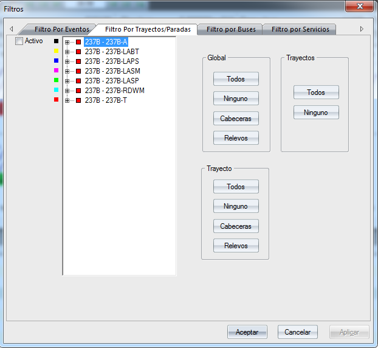
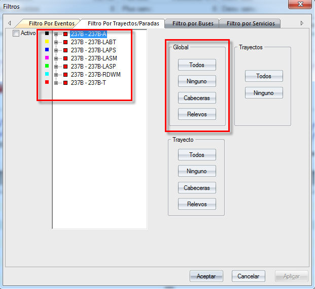
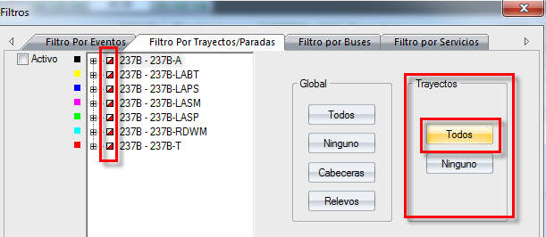
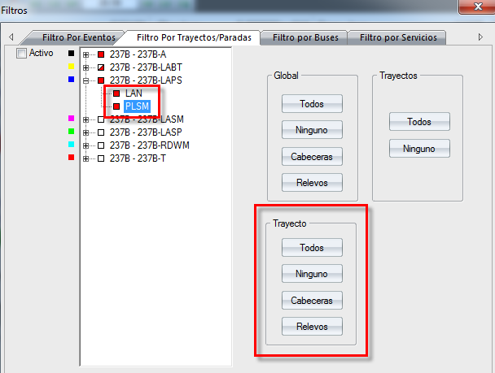

::: {#filtro-por-trayectosparadas .section .level3}
### Filtro por Trayectos/Paradas

Este filtro ofrece la posibilidad de mostrar/ocultar las líneas y/o
paradas que componen el escenario de GoalBus®.

[]{#_Toc465674624 .anchor}197 Filtro por Trayectos / Paradas

Para seleccionar todos los trayectos y/o paradas que se deseen
visualizar, y disponer de ellos en la solución de GoalBus®, solamente
hay que seleccionarlos en el apartado **Global** \> **Todos**. Estos
trayectos y/o paradas seleccionados aparecerán con el cuadrado adjunto
relleno de color como se muestra en la siguiente imagen anterior,
(), que abre la paleta de colores estándar de
Windows al pinchar sobre éste y permite seleccionar el color de
visualización de cada línea, y fuera de la ventana aparecerá otro cuadro
con un color distinto por cada trayecto.

Para deseleccionar todos los trayectos y/o paradas basta con pulsar el
apartado **Global** \> **Ninguno**. Los cuadrados adjuntos a los
trayectos y paradas aparecerán sin relleno.

Se pueden también seleccionar o deseleccionar las cabeceras y/o paradas
donde se realicen relevos en esta ventana GLOBAL:

[]{#_Toc465674625 .anchor}198 Activar el filtro Global

El apartado **Trayectos** permite seleccionar todos los trayectos con la
opción **Todos** o deseleccionar todos con la opción **Ninguno**. Si se
seleccionan todos los trayectos aparecerán con el cuadrado adjunto
semi-relleno, si por el contrario se deseleccionan aparecerán con el
cuadrado en blanco:

[]{#_Toc465674626 .anchor}199 Activar todos los trayectos

En el apartado **Trayecto** permite realizar el filtrado por cada
trayecto. Por ello habrá que seleccionar el trayecto que se quiere
filtrar y luego seleccionar bien, la opción de filtrado, bien la opción
por cabeceras o bien la opción por paradas que permitan relevar.

[]{#_Toc465674627 .anchor}200 Activar todas las paradas del trayecto
:::
