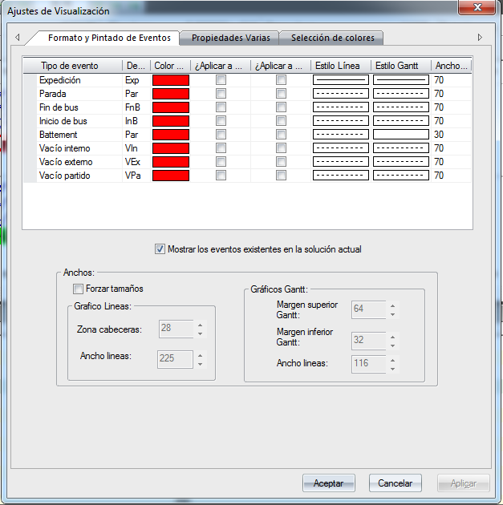

::: {#formato-eventos .section .level3}
### Formato eventos

Esta herramienta permite al usuario personalizar la visualización de
cada evento para cada uno de los diagramas de visualización.

[]{#_Toc465674628 .anchor}201 Formato Eventos

-   Estilo de líneas. Para cada uno de los eventos que intervienen en
    > una solución se puede elegir el color y el grosor en los distintos
    > diagramas en los que es posible visualizar una solución. Además,
    > se puede indicar el grosor de la línea en caso de seleccionarla.

-   Ancho de Gantt. En el Diagrama de Gantt, se define aquí el tamaño de
    > los bloques para cada uno de los eventos de GoalBus®.
:::
