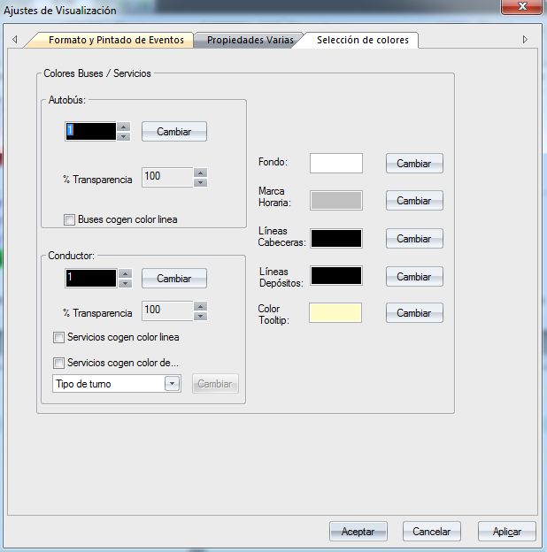

::: {#selección-de-colores .section .level3}
### Selección de colores

Gracias a este filtro, el usuario puede visualizar una misma solución de
múltiples maneras, ya que puede elegir:

-   Autobús: El color que toma cada autobús en la solución.

-   Conductor: El color que toma cada servicio de conductor en la
    > solución.

-   Buses cogen color línea: En el gráfico de líneas, activar esta
    > opción para que el color de cada autobús coincida con el color de
    > la línea dónde interviene.

-   Servicios cogen color línea: En el gráfico de líneas, activar esta
    > opción para que el color de cada servicio de conductor coincida
    > con el color de la línea dónde actúa.

-   Fondo: El color de fondo de la pantalla.

-   Marca Horaria: El color de las marcas horarias de la pantalla.

-   Líneas Cabeceras: El color que toman los nombres de las paradas
    > cabeceras de cada línea del escenario.

[]{#_Toc465674629 .anchor}202 Selección de Colores

[[[[[[[]{#_Toc289165971 .anchor}]{#_Toc222216772
.anchor}]{#_Toc222135890 .anchor}]{#_Toc221622798
.anchor}]{#_Toc184120181 .anchor}]{#_Toc128972550
.anchor}]{#_Toc124911493 .anchor}
:::
