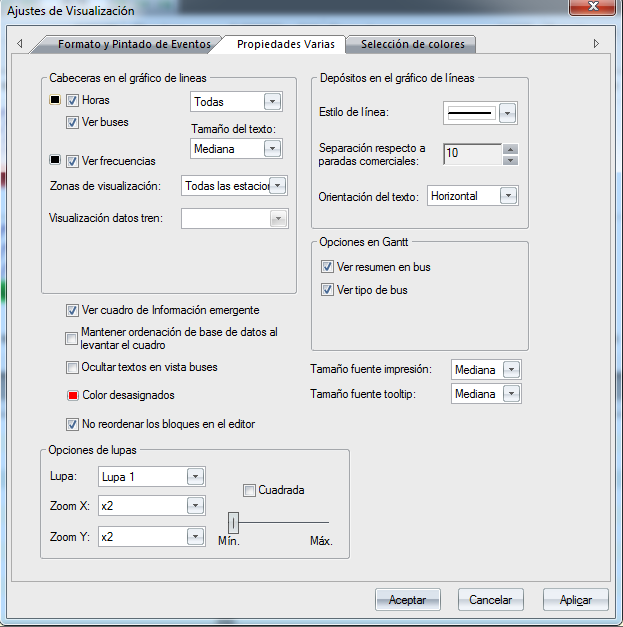

::: {#propiedades-varias .section .level3}
### Propiedades varias

Las siguientes opciones están disponibles en este filtro:

-   Ver horas de salida: Mostrar o no las horas de inicio de cada evento
    > en la solución de GoalBus®.

-   Ver buses: Ver el número de autobús que realiza cada uno de los
    > eventos.

-   Ver conductores: Se tiene la opción de ocultar o mostrar el servicio
    > de conductor que realiza cada expedición, viaje en vacío,\...

Para estas cuatro opciones, el usuario puede elegir el color y tamaño de
visualización.

-   Ver cuadro de información emergente: Permite ver las ventanas de
    > información que aparecen al posar el "ratón" sobre las ventanas
    > donde visualizamos la solución.

-   Ocultar textos en vista buses/servicios: Con esta opción se ocultan
    > o se muestran todos los textos en los Diagramas de Gantt de
    > autobuses y de servicios de conductor.

-   Color desasignados: Descarta un determinado color de forma que no
    > aparezca en la solución de GoalBus®.

[]{#_Toc465674630 .anchor}203 Propiedades Varias
:::
