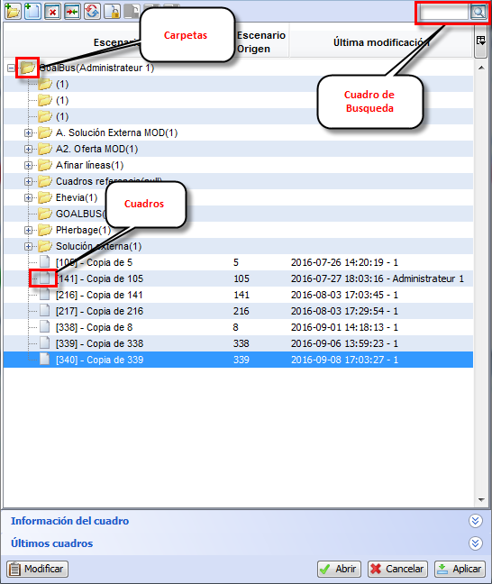

::: {#árbol-de-cuadros .section .level3}
### Árbol de cuadros

Para usar los atajos propios de un cuadro o carpeta debemos tener
seleccionado algún elemento dentro del árbol de cuadros.

[]{#_Toc465674631 .anchor}204 Árbol de cuadros

-   **F2**: Muestra las propiedades de un cuadro o carpeta

-   **F3**: Se pondrá en la caja de texto de búsqueda de cuadros.

-   **Crtl** + **F3**: Se abrirá la ventana de búsqueda de cuadros.
:::
