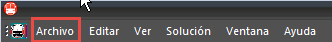
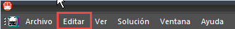
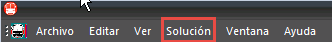
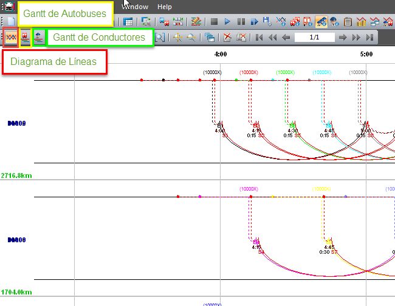

::: {#cálculo-de-soluciones .section .level3}
### Cálculo de soluciones

Menú de opciones Archivo:

En la parte superior izquierda aparece el menú Archivo.

-   **Ctrl** + **N**: Nuevo

-   **Ctrl** + **A**: Abrir

-   **Ctrl** + **G**: Guardar

-   **F7**: Editar

-   **F4**: Tablas auxiliares

-   **Ctrl** + **F**: Fusión

-   **Ctrl** + **P**: Imprimir

-   Menú de opciones Editar:

En la parte superior izquierda aparece el menú Editar.

-   **Ctrl** + **Y**: Rehacer

-   **Ctrl** + **Z**: Deshacer

Menú de opciones Solución:

En la parte superior izquierda aparece el menú Solución.

-   **Ctrl** + **Mayúscula** + Tecla de sustracción: Primera solución

-   **Ctrl** + **Tecla de sustracción**: Para atrás rápido

-   **Tecla de sustracción** (teclado numérico): Solución anterior

-   **Tecla de adición** (teclado numérico): Solución Siguiente

-   **Ctrl** + **Tecla de adición**: Hacia adelante rápido

-   **Ctrl** + **Mayúscula** + **+**: Última solución

Los atajos para desplazarnos dentro de una solución ya sea en el
Diagrama de Líneas, en el Diagrama de Gantt de Conductores o en el
Diagrama de Gantt de Autobuses son los siguientes:

[]{#_Toc465674632 .anchor}205 Accesos a los distintos diagramas de una
solución.

-   **Ctrl** + **Mayúscula** + : final de la solución

-   **Ctrl** + **Mayúscula** + : inicio de la solución

-   **Ctrl** + : avance rápido de la solución hacia la derecha

-   **Ctrl** + : avance rápido de la solución hacia la izquierda

-   : avance de la solución hacia la derecha

-   : avance de la solución hacia la izquierda

-   **Ctrl** + **Mayúscula** + : final de la solución

-   **Ctrl** + **Mayúscula** + **Flecha arriba**: inicio de la solución

-   **Ctrl** + : avance rápido de la solución hacia la abajo

-   **Ctrl** + : avance rápido de la solución hacia la arriba

-   : avance de la solución hacia la abajo

-   : avance de la solución hacia la arriba
:::
