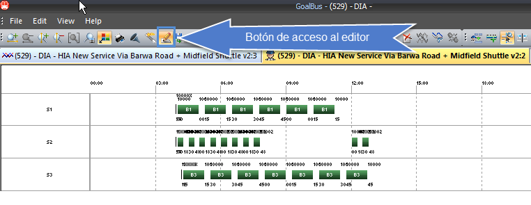
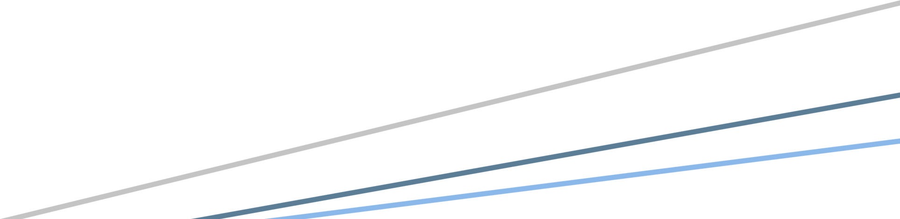

::: {#editor .section .level3}
### Editor

Una vez accedamos al editor de una solución de GoalBus® podremos usar
los siguientes atajos de teclado en las tres pestañas de Diagrama de
Líneas, de Diagrama de Gantt de Conductores o de Diagrama de Gantt de
Autobuses:

[]{#_Toc465674633 .anchor}206 Editor de GoalBus®

-    : Mover a la izquierda una unidad

-   **Ctrl** +  : Mover a la izquierda 5 unidades

-   : Mover a la derecha

-   **Ctrl** + : Mover a la derecha 5 unidades

-   : Redimensionar una +1 unidad por la derecha

-   **Ctrl** +: Redimensionar una -1 unidad por la derecha

-   : Redimensionar una +1 unidad por la izquierda

-   **Ctrl** + : Redimensionar una -1 unidad por la izquierda

-   **Ctrl** + **A**: Seleccionar todo

-   **Esc**: Deseleccionar todo

-   **Supr**: Borrar lo seleccionado

-   **Ctrl** + **P**: Activar la acción de permutar eventos

-   **Ctrl** + **E**: Salir del editor

-   **F7** : Abrir parámetros del cuadro en modo solo lectura

-   **F8**: Abrir ventana de configuración de settings del editor

-   **F5**: Activar automatismos de cálculo del editor

-   **+** : Zoom in horizontal

-   **-** : Zoom out horizontal

-   **Inicio** (Home): Zoom fit

[[[[[]{#_Toc289165978 .anchor}]{#_Toc222216779 .anchor}]{#_Toc222135896
.anchor}]{#_Toc184120185 .anchor}]{#_Toc128972677 .anchor}

GLOSARIO[[]{#_Toc221624674 .anchor}]{#_Toc128972678 .anchor}

Adscripción

Una parada perteneciente a un trayecto se puede adscribir a otra. Con
esta relación se pretende modelar, por ejemplo, la situación que se
sucede cuando los Autobuses y conductores que hacen un trayecto proceden
de una cochera de la compañía. Una forma de modelar esta situación es
adscribir la cabecera (A) del trayecto a la cochera (que debe ser una
parada previamente definida). De esta manera, cuando se necesite un
autobús o un servicio en la cabecera A, si no están disponibles allí
mismo, se pueden obtener de la cochera mediante un viaje en vacío entre
la cochera y A.

[[]{#_Toc221624675 .anchor}]{#_Toc128972679 .anchor}Arcos de Línea

Arcos que definen los trayectos de una línea. Los arcos que definen un
sentido de un trayecto tienen asociados un número de secuencia.

[[]{#_Toc221624676 .anchor}]{#_Toc128972680 .anchor}Arco

Un arco define una relación entre dos paradas. Un arco posee un sentido,
es decir, en todo arco existe una parada origen y una parada destino. Un
autobús sólo puede recorrer un camino con viajeros, si éste ha sido
definido mediante un arco. Cuando se define un arco entre dos paradas se
está informando de la existencia de un recorrido entre ambas paradas.

[[]{#_Toc221624677 .anchor}]{#_Toc128972681 .anchor}Autobús Inactivo

Un autobús está inactivo siempre que no esté realizando una expedición o
viaje en vacío y que no esté en depósito o cochera.

[[]{#_Toc221624678 .anchor}]{#_Toc128972682 .anchor}Autobuses Entrantes
(Paradas con Capacidad de)

Se entiende que una parada tiene capacidad para albergar autobuses
entrantes si un autobús puede terminar su servicio y puede ser
estacionado definitivamente durante esa jornada.

[[]{#_Toc221624679 .anchor}]{#_Toc128972683 .anchor}Autobuses Salientes
(Paradas con Capacidad de)

Se entiende que una parada tiene capacidad para albergar autobuses
salientes si se puede disponer de un determinado número de autobuses
estacionados en esta parada para su utilización en algún servicio.

[]{#_Toc221624680 .anchor}Autonomía

La autonomía de un autobús indica el número de metros que puede estar
sin repostar un autobús.

[]{#_Toc221624681 .anchor}Bloques de conducción

Tiempo de conducción acumulado desde el momento en que un conductor
empieza a conducir tras un período de descanso o una pausa hasta que
toma un nuevo período de descanso o una pausa. El período de conducción
puede ser continuado o interrumpido.

[[]{#_Toc221624682 .anchor}]{#_Toc128972684 .anchor}Cambio de Autobús

Se produce cuando un conductor deja un autobús y toma otro.

[[]{#_Toc221624683 .anchor}]{#_Toc128972685 .anchor}Cambio de Línea
(Evento de)

Evento sin duración que indica el cambio de línea de un autobús y/o
conductor.

[]{#_Toc221624684 .anchor}Capacidad de un autobús

Número de personas que pueden ocupar físicamente un autobús.

[[]{#_Toc221624685 .anchor}]{#_Toc128972686 .anchor}Conexión de
Autobuses

Una conexión entre dos paradas define una relación entre ellas que posee
un sentido, es decir, en toda conexión existe una parada origen y una
parada destino, un trayecto origen y un trayecto destino y un sentido
origen y un sentido destino. Un autobús sólo puede realizar un viaje en
vacío entre dos paradas, o un cambio de línea en la misma parada, si
está definida la conexión entre esas dos paradas. Las conexiones sólo
tienen vigencia dentro del escenario que se está definiendo.

[[]{#_Toc221624686 .anchor}]{#_Toc128972687 .anchor}Coste en la Función
Objetivo

Define el coste que se intenta minimizar en las soluciones. En este
coste se tienen en cuenta consideraciones económicas y también
consideraciones intangibles de corte no puramente económico, como
penalizaciones por situaciones no deseadas.

[[]{#_Toc221624687 .anchor}]{#_Toc128972688 .anchor}Coste Real

El coste real se utiliza como valoración puramente económica de las
soluciones.

[[]{#_Toc221624688 .anchor}]{#_Toc128972689 .anchor}Escenario Activo

La activación de un escenario supone su exportación junto con sus
soluciones hacia sistemas de información externos. Esta opción se
utiliza si GoalBus® se encentra integrado con otros sistemas que
colaboran con él, como GoalDriver®.

[[]{#_Toc221624689 .anchor}]{#_Toc128972690 .anchor}Escenario

Un escenario es un problema que GoalBus® resuelve. Se define mediante la
agrupación de todos los elementos que definen un problema de
planificación de transporte. Un escenario representa una situación
concreta cuya planificación se quiere optimizar. Puede definir tantos
escenarios como desee, e incluso puede definir dos o más escenarios con
prácticamente los mismos datos, para ver cómo cambian los costes de las
soluciones propuestas por GoalBus® cuando se modifica algún parámetro
del problema.

[[]{#_Toc221624690 .anchor}]{#_Toc128972691 .anchor}Deje de Autobús
(Evento de)

Periodo de tiempo que transcurre desde que un conductor termina una
expedición o un viaje en vacío programado, hasta que puede dejar el
autobús.

[[]{#_Toc221624691 .anchor}]{#_Toc128972692 .anchor}Deje de Autobús en
Cambios.

Periodo de tiempo que transcurre desde que un conductor deja un autobús
hasta que toma otro autobús.

[[]{#_Toc221624692 .anchor}]{#_Toc128972693 .anchor}Deje de Autobús en
Final.

Periodo de tiempo que transcurre desde que un conductor finaliza su
última expedición hasta que deja el autobús en depósito.

[[]{#_Toc221624693 .anchor}]{#_Toc128972694 .anchor}Descanso (Evento de)

Periodo de tiempo en el que un servicio de conductor descansa, dentro de
su jornada laboral.

[[]{#_Toc221624694 .anchor}]{#_Toc128972695 .anchor}Descanso (Parada con
Capacidad de)

Una parada con capacidad de descanso puede utilizarse por los
conductores para descansar.

[[]{#_Toc221624695 .anchor}]{#_Toc128972696 .anchor}Desperdicio de
Jornada

El tiempo de desperdicio de jornada es el tiempo que falta en una
jornada de trabajo para completar el tiempo máximo de jornada normal
cuando cobra por jornada.

[[]{#_Toc221624696 .anchor}]{#_Toc128972697 .anchor}Desplazamiento
(Evento de)

Periodo de tiempo consumido por un conductor para desplazarse de una
parada a otra, por medios distintos del Autobús que conduce.

[[]{#_Toc221624697 .anchor}]{#_Toc128972698 .anchor}Desvío de Frecuencia

Todo desvío de la frecuencia óptima que se define en la oferta de una
parada con capacidad de regularización. El desvío no puede superar las
frecuencias mínima y máxima.

[[]{#_Toc221624698 .anchor}]{#_Toc128972699 .anchor}Entrada (Paradas con
Capacidad de)

Una parada con capacidad de entrada puede incorporar al trayecto
autobuses que no estaban realizando dicho trayecto (por estar aparcados,
por haber estado en otra línea, por venir de cocheras), sobre todo para
poder lograr variaciones en las frecuencias de paso.

[[]{#_Toc221624699 .anchor}]{#_Toc128972700 .anchor}Evento

Cada una de las acciones indivisibles que pueden llevar a cabo tanto los
conductores, como los autobuses involucrados en una solución.

[[]{#_Toc221624700 .anchor}]{#_Toc128972701 .anchor}Expedición (Evento
de)

Periodo de tiempo que transcurre desde que se inicia hasta que se
finaliza un trayecto con viajeros, desde una parada origen a una parada
destino.

[[]{#_Toc221624701 .anchor}]{#_Toc128972702 .anchor}Expedición en Vacío
(Evento de)

Véase viaje en vacío.

[[]{#_Toc221624702 .anchor}]{#_Toc128972703 .anchor}Filtro de Eventos

Permite visualizar sólo los eventos que le interesen al usuario en las
ventanas de información de autobuses, servicios y eventos.

[[]{#_Toc221624703 .anchor}]{#_Toc128972704 .anchor}Fin de Autobús
(Evento de)

Periodo de tiempo que transcurre desde que un autobús finaliza su última
expedición o viaje en vacío programado, hasta que es dejado por el
conductor.

[[]{#_Toc221624704 .anchor}]{#_Toc128972705 .anchor}Fin de Servicio
(Evento de)

Periodo de tiempo que transcurre desde que un conductor termina su
última expedición o viaje en vacío programado, hasta que termina su
jornada laboral.

[[]{#_Toc221624705 .anchor}]{#_Toc128972706 .anchor}Frecuencias de paso

Intervalo temporal de separación entre autobuses en una parada con
capacidad de regulación. Las frecuencias de paso definen la oferta
comercial de una línea.

[[]{#_Toc221624706 .anchor}]{#_Toc128972707 .anchor}Gantt de Autobuses
(Diagrama de)

Tipo de gráfico temporal en el que se muestran las soluciones,
desglosadas por autobús. Para cada autobús que participa en la solución
se muestra toda su actividad diaria.

[[]{#_Toc221624707 .anchor}]{#_Toc128972708 .anchor}Gantt de Servicios
(Diagrama de)

Tipo de gráfico temporal en el que se muestran las soluciones,
desglosadas por los servicios que participan. Para cada servicio que
participa en la solución se muestra toda su actividad diaria.

[[]{#_Toc221624708 .anchor}]{#_Toc128972709 .anchor}Gráfico de líneas

Tipo de gráfico temporal en el que se muestran las soluciones con
líneas, en forma de diente de sierra.

[[]{#_Toc221624709 .anchor}]{#_Toc128972710 .anchor}Grupo

Conjunto de tipos de servicio que comparten restricciones comunes. Estas
restricciones son la máxima jornada, la máxima duración del primer tramo
de trabajo, la máxima duración del primer y segundo tramo de trabajo (si
lo hay), el máximo tiempo de conducción, la mínima hora de inicio y la
máxima hora de finalización. Es posible trabajar con cuatro grupos A, B,
C y D.

[[]{#_Toc221624710 .anchor}]{#_Toc128972711 .anchor}Hora Extra Nocturna

Hora de trabajo nocturna que se computa cuando se han superado las horas
de la jornada normal.

[[]{#_Toc221624711 .anchor}]{#_Toc128972712 .anchor}Hora Extra

Hora de trabajo diurna que se computa cuando se han superado las horas
de la jornada normal.

[[]{#_Toc221624712 .anchor}]{#_Toc128972713 .anchor}Hora Normal Nocturna

Hora de trabajo nocturna que se computa dentro de la jornada normal.

[[]{#_Toc221624713 .anchor}]{#_Toc128972714 .anchor}Hora Normal

Hora de trabajo diurna que se computa dentro de la jornada normal.

[[]{#_Toc221624714 .anchor}]{#_Toc128972715 .anchor}Inicio de Autobús
(Evento de)

Periodo de tiempo que transcurre desde que un autobús es tomado por
primera vez hasta que puede comenzar su primera expedición o un viaje en
vacío programado.[]{#_Toc128972716 .anchor}

[]{#_Toc221624715 .anchor}Inicio de Servicio (Evento de)

Periodo de tiempo que transcurre desde que un conductor se presenta al
inicio de su jornada, hasta que comienza su servicio de conducción.

[[]{#_Toc221624716 .anchor}]{#_Toc128972717 .anchor}Jornada Normal

Jornada laboral pagada como horas normales. Todo lo que supere la
jornada normal se pagará como horas extra.

[[]{#_Toc221624717 .anchor}]{#_Toc128972718 .anchor}Jornada Total

Jornada real de trabajo de un servicio. Si supera la duración de la
jornada normal, el exceso de horas se pagará como horas extra.

[[]{#_Toc221624718 .anchor}]{#_Toc128972719 .anchor}Línea

Agrupación bajo un mismo nombre (normalmente de carácter comercial), de
uno o más trayectos.

[[]{#_Toc221624719 .anchor}]{#_Toc128972720 .anchor}Líneas Combinadas

Conjunto de líneas entre las que puede haber intercambio de recursos,
con el objetivo de optimizar los recursos empleados en la solución
conjunta de dichas líneas.

[[]{#_Toc221624720 .anchor}]{#_Toc128972721 .anchor}Localizador
Automático

Funcionalidad del sistema que permite que al seleccionar cualquier fila
de la ventana de información de servicios, eventos, o de autobuses, la
ventana principal de diagramación de soluciones realice un
desplazamiento automático hasta señalar el evento seleccionado en la
ventana. Este localizador automático funciona con los tres diagramas de
solución, gráfico de líneas y de Gantt en sus dos vertientes. El
localizador automático trabaja en los dos sentidos, de la ventana
principal a las ventanas de información y viceversa.

[[]{#_Toc221624721 .anchor}]{#_Toc128972722 .anchor}Multilínea

Ver Líneas Combinadas.

[[]{#_Toc221624722 .anchor}]{#_Toc128972723 .anchor}Nocturnidad

Periodo del día en el que se estima que el trabajo es nocturno y que por
lo tanto, puede considerarse un coste diferente al del resto del día.

[[]{#_Toc221624723 .anchor}]{#_Toc128972724 .anchor}Oferta

La oferta define el servicio que se pretende dar en cada trayecto, para
cada uno de los dos sentidos de la marcha, para todos los trayectos
incluidos en el escenario.

[[]{#_Toc221624724 .anchor}]{#_Toc128972725 .anchor}Parada (Evento de)

Periodo de tiempo que transcurre parado un autobús y/o un conductor en
una parada.

[[]{#_Toc221624725 .anchor}]{#_Toc128972726 .anchor}Parada

Lugar físico relevante para el problema, bien por ser cabecera o
terminal de línea; por utilizarse para regulación, descansos, cambios de
servicio de conductor; o por cualquier otra circunstancia de interés
para el problema que se pretende resolver.

Pausa

Interrupción del tiempo seguido de conducción. Cuando el tiempo seguido
de conducción supera el máximo establecido, se obliga a realizar una
pausa y comienza un nuevo bloque de conducción. El tiempo de pausa
durante un bloque puede ser continuado o repartido en varias pausas que
superan una longitud mínima establecida.

[[]{#_Toc221624726 .anchor}]{#_Toc128972727 .anchor}Periodicidad

Define un conjunto de días de la semana entre uno o varios intervalos de
fechas. Una periodicidad define, por lo tanto, un subconjunto de días
pertenecientes al conjunto de días de un periodo de tiempo.

[[]{#_Toc221624727 .anchor}]{#_Toc128972728 .anchor}Regulación (Paradas
con capacidad de)

Una parada con capacidad de regulación es aquella en la que debe
cumplirse una frecuencia de paso ofertada.

[[]{#_Toc221624728 .anchor}]{#_Toc128972729 .anchor}Relevo (Paradas con
capacidad de)

Una parada con capacidad de relevo es aquella que puede usarse para
realizar un relevo de conductores en un autobús.

[[]{#_Toc221624729 .anchor}]{#_Toc128972730 .anchor}Relevo

Por relevo se entiende el cambio de conductor en un autobús. Puede
obligarse a que el conductor relevado tenga que esperar su relevo, o
puede permitirse que deje el autobús estacionado sin esperar a que
llegue el otro conductor.

[]{#_Toc221624730 .anchor}Repostaje (Evento de)

Periodo de tiempo destinado para que una persona encargada al efecto
realice la carga de combustible de un autobús.

[[]{#_Toc221624731 .anchor}]{#_Toc128972731 .anchor}Restricción

Cualquier circunstancia que deba cumplirse en las soluciones que calcula
GoalBus®, aplicable a personas, autobuses o cualquier otro elemento, y
se pueden modificar tanto en las tablas auxiliares como en los
escenarios.

Las restricciones pueden ser generales para autobuses, y generales o
particulares para un servicio de conductor.

[[]{#_Toc221624732 .anchor}]{#_Toc128972732 .anchor}Salida (Paradas con
Capacidad de)

Una parada con capacidad de salida es aquella que permite retirar del
trayecto autobuses (por finalización de autobús, porque cambian de
línea, para ir a cocheras), sobre todo para poder lograr variaciones en
las frecuencias de paso.

[[]{#_Toc221624733 .anchor}]{#_Toc128972733 .anchor}Sentido (de un
trayecto)

Un trayecto siembre posee dos sentidos, el de ida (sentido 1) y el de
vuelta (sentido 2). Cada uno de los sentidos se define mediante una
secuencia de arcos de línea, de manera que el destino de un arco debe
ser el origen del siguiente. Ambos sentidos pueden tener diferentes
arcos.

[[]{#_Toc221624734 .anchor}]{#_Toc128972734 .anchor}Servicios entrantes
(Paradas con Capacidad de)

Se entiende que una parada tiene capacidad para albergar servicios
entrantes, si un servicio de conductor puede terminar su jornada laboral
en la parada.

[[]{#_Toc221624735 .anchor}]{#_Toc128972735 .anchor}Servicios salientes
(Paradas con Capacidad de)

Se entiende que una parada tiene capacidad para albergar servicios
salientes, si se puede disponer de un determinado número de servicios de
conductor preparados en esta parada, para su utilización.

[[]{#_Toc221624736 .anchor}]{#_Toc128972736 .anchor}Servicio

Servicio de conductor. Representa la jornada laboral de un conductor de
Autobús.

[[]{#_Toc221624737 .anchor}]{#_Toc128972737 .anchor}Solución

Secuencia de eventos que de realizarlas tanto los autobuses como los
conductores que participan en la resolución de un problema, satisfarían
todas las restricciones planteadas en ese problema o escenario. Toda
solución tiene un coste (real y de función objetivo) asociado. GoalBus®
obtiene para cada problema una lista de soluciones ordenadas por el
coste de la función objetivo.

Tablas auxiliares

Para poder crear escenarios antes hay que introducir todos los datos
estructurales que definen el modelo de la red de transporte de su
empresa. Toda esta información se introduce en unas tablas denominadas
tablas auxiliares. Las tablas auxiliares contienen los datos
estructurales que resultan comunes a todos los problemas expresados como
escenarios. Las tablas auxiliares actúan como catálogo para la formación
de problemas, evitándose de esta manera tener que introducir información
repetida para escenarios distintos.

[[]{#_Toc221624739 .anchor}]{#_Toc128972739 .anchor}Tipo de Servicio
General

Tipo de servicio que agrupa restricciones aplicables a todos los tipos
de servicio no generales definidos.

[]{#_Toc221624740 .anchor}Tipo de Servicio General de Autobús

Tipo de servicio que agrupa restricciones aplicables a todos los tipos
de autobús.

[[]{#_Toc221624741 .anchor}]{#_Toc128972740 .anchor}Tipo de servicio

Un tipo de servicio de conductor agrupa todas las características y
restricciones de un tipo de jornada laboral de los conductores de la
empresa (turno continuo, turno partido, refuerzo, etc.)

[[]{#_Toc221624742 .anchor}]{#_Toc128972741 .anchor}Toma de Autobús
(Evento de)

Periodo de tiempo que transcurre desde que un conductor entra en un
autobús hasta que puede comenzar su siguiente expedición o viaje en
vacío programado.

[[]{#_Toc221624743 .anchor}]{#_Toc128972742 .anchor}Tramo

Periodo de tiempo en que puede dividirse la jornada laboral de un
servicio. La separación entre tramos viene dada por un descanso.

[[]{#_Toc221624744 .anchor}]{#_Toc128972743 .anchor}Trayecto

Itinerario de ida y vuelta entre dos paradas llamadas cabecera y
terminal, con posibles paradas intermedias. Un trayecto siembre
pertenece a una línea y posee dos sentidos, el de ida (sentido 1) y el
de vuelta (sentido 2). Cada uno de los sentidos se define mediante una
secuencia de arcos, de tal manera que el destino de un arco debe ser el
origen del siguiente. Los trayectos son únicos entre todas las líneas.

[[]{#_Toc221624745 .anchor}]{#_Toc128972744 .anchor}Validez (de un
elemento)

Fecha a partir de la cual la definición del elemento es válida.

[[]{#_Toc221624746 .anchor}]{#_Toc128972745 .anchor}Ventana de
Información de Autobuses

La ventana de información de autobuses muestra información detallada
sobre los autobuses que participan en la solución mostrada en la ventana
principal de diagramación de soluciones.

[[]{#_Toc221624747 .anchor}]{#_Toc128972746 .anchor}Ventana de
Información de Costes

La ventana de información de costes muestra los detalles de los costes
que implica la solución que se está visualizando en la ventana principal
de diagramación de soluciones.

[[]{#_Toc221624748 .anchor}]{#_Toc128972747 .anchor}Ventana de
Información de Eventos

La ventana de información de eventos muestra información sobre todos los
eventos que suceden en una solución.

[[]{#_Toc221624749 .anchor}]{#_Toc128972748 .anchor}Ventana de
Información de Servicios

La ventana de información de servicios muestra información detallada
sobre los servicios que participan en la solución mostrada en la ventana
principal de diagramación de soluciones.

[[]{#_Toc221624750 .anchor}]{#_Toc128972749 .anchor}Ventana Principal de
Diagramación de Soluciones

Ventana en la que se muestran las soluciones en alguno de los tres
modos: gráfico de líneas, Gantt de Autobuses o Gantt de servicios.

[[]{#_Toc221624751 .anchor}]{#_Toc128972750 .anchor}Viaje en Vacío
(Evento de)

Periodo de tiempo que transcurre desde que se inicia hasta que finaliza
un trayecto sin viajeros, desde una parada origen a una parada destino.

Imágenes y Gráficos del Documento

[1. Descripción o Título
1](file:///O:\Departamentos\Diseño\01_Documentacion\MPGEN-Edicion%20de%20Documentos%20Corporativos%204.2.docx#_Toc361824973)

:::
