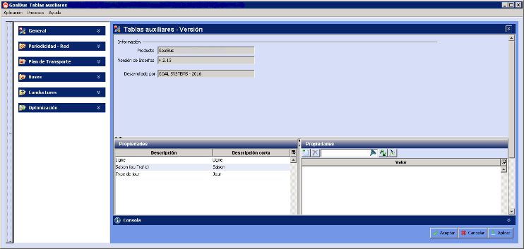

::: {#introducción-de-datos .section .level1}
Introducción de datos
=====================

En este capítulo se van a presentar dos sistemas de introducción de
datos de GoalBus®: las Tablas auxiliares y los Escenarios.

Las Tablas auxiliares son una herramienta fundamental dentro de
GoalBus®, ya que agrupan toda la información necesaria para modelar un
sistema de transporte. Esta información suele ser común a todo el
sistema y está siempre disponible para el usuario, lo que evita tener
que introducir información repetida.

Una vez introducidos los datos en las Tablas auxiliares, el usuario
puede crear distintos cuadros, que son archivos con datos para calcular
distintas soluciones de planificación. Cada cuadro tiene asociado un
escenario de planificación, que almacena las condiciones de la situación
concreta que se desea optimizar en la red de transporte. El usuario
puede generar tantos cuadros como situaciones distintas desee optimizar,
asociando distintos datos en el escenario de cada cuadro. Para ello, le
serán de gran utilidad las Tablas auxiliares, ya que desde ellas se
pueden copiar la selección de datos (típicamente, una línea o conjunto
de líneas) que se decide añadir en el escenario. Posteriormente, el
usuario puede modificar dentro de cada escenario aquellos datos que no
se corresponden exactamente con el modelo general.

[]{#_Toc465674438 .anchor}11 Tablas auxiliares y escenarios

[]{#_Toc289165865 .anchor}
:::
